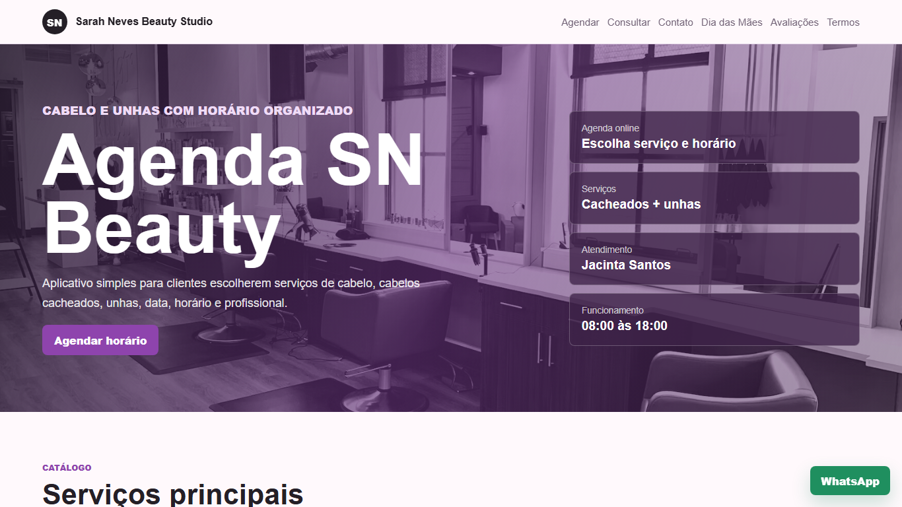
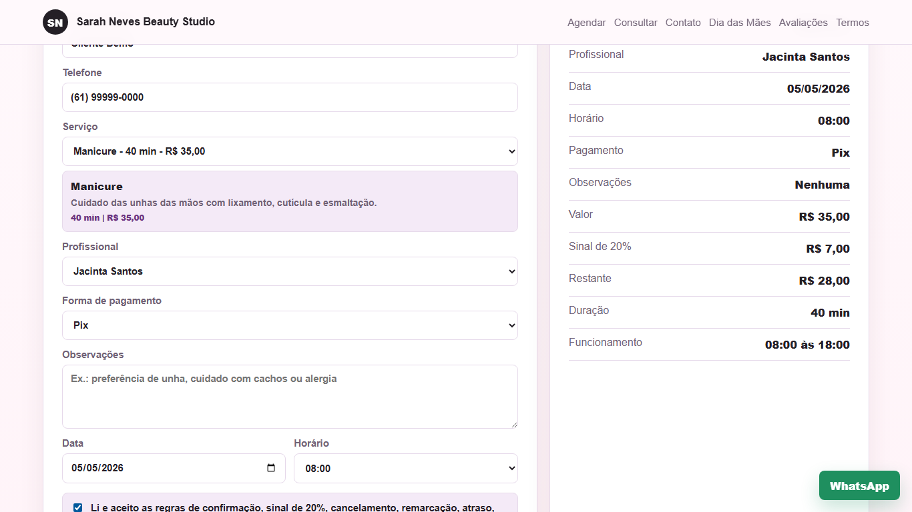

# Agenda SN Beauty


Sistema web de agendamento para o **Sarah Neves Beauty Studio**, criado para transformar pedidos manuais de horário em um fluxo digital com experiência pública, painel administrativo, persistência em banco, validações de negócio e rotina de qualidade automatizada.

> Projeto de portfólio com foco em produto real: organização operacional, segurança básica, responsividade, clareza para a cliente e ferramentas administrativas para a profissional.

## Links Rápidos

- [Demo online](https://agenda-sn-beauty.onrender.com)
- [PRD do produto](docs/PRD.md)
- [Demonstração visual](#demonstração-visual)
- [Preview das telas](#preview)
- [Como rodar localmente](#como-rodar-localmente)
- [Qualidade e testes](#qualidade)
- [Rotas principais](#rotas-principais)

## Visão Geral

O Agenda SN Beauty resolve um problema comum em pequenos negócios de beleza: controlar horários, evitar conflitos, organizar confirmações e manter a cliente informada sem depender apenas de conversas soltas no WhatsApp.

A cliente escolhe serviço, profissional, data, horário e forma de pagamento. A administradora acompanha pedidos, confirma atendimentos, remarca, cancela, conclui, exporta dados, modera avaliações e consulta indicadores de saúde do sistema.

O documento central de produto fica em [`docs/PRD.md`](docs/PRD.md). Ele descreve problema, público-alvo, requisitos, regras de negócio, critérios de aceite, riscos e roadmap.

## Preview

| Site público | Mobile | Painel administrativo |
| --- | --- | --- |
|  |  |  |

## Demonstração Visual

| Página inicial | Fluxo de agendamento |
| --- | --- |
|  |  |

As imagens acima mostram a experiência pública e o preenchimento do fluxo principal de agendamento.

## Por Que Este Projeto Se Destaca

- **Produto completo:** site público, painel administrativo, termos, avaliações, consulta de agendamento e rotas REST.
- **Regra de negócio real:** bloqueio de horários conflitantes considerando duração do serviço e expediente.
- **Segurança aplicada:** sessão administrativa assinada, cookie `HttpOnly`, rate limit, CSP e proteção contra acesso a arquivos internos.
- **Persistência flexível:** Supabase para produção e `database.json` como fallback local para desenvolvimento.
- **Qualidade verificável:** smoke tests, validação responsiva, teste visual com Playwright e auditoria de dependências.
- **Experiência profissional:** telas responsivas, mensagens claras, fluxo de aceite de termos e painel voltado para operação diária.
- **SEO local:** dados estruturados Schema.org para salão de beleza, endereço, WhatsApp, horários e serviços.
- **Operação observável:** auditoria de visitas, início de agendamento, avaliações e ações administrativas relevantes.

## Funcionalidades

### Cliente

- Escolha de serviço, profissional, data, horário e forma de pagamento.
- Disponibilidade calculada com base no expediente e na duração real do atendimento.
- Confirmação com protocolo, status, resumo, WhatsApp e opção de copiar dados.
- Consulta pública segura do próprio agendamento por telefone e data.
- Aceite obrigatório dos termos antes da criação do pedido.
- Avaliações públicas com nota, comentário e proteção antispam simples.
- Menu hambúrguer no mobile e navegação adaptada para telas até 768px.

### Administração

- Login protegido por senha via variável de ambiente.
- Dashboard com pedidos, filtros, busca, visão semanal e status.
- Confirmação, conclusão, cancelamento e remarcação de atendimentos.
- Moderação de avaliações.
- Exportação CSV e backup JSON.
- Monitor de saúde com storage, Supabase, notificações e auditoria.
- Registro de visitas, início de agendamento e avaliações na auditoria administrativa.
- Notificação por webhook para ações importantes quando `NOTIFICATION_WEBHOOK_URL` estiver configurado.

## Decisões Técnicas

- **HTML, CSS e JavaScript sem framework:** escolha intencional para demonstrar domínio da base web, responsividade e manipulação direta do DOM.
- **Node.js + Express:** API REST simples, clara e adequada ao escopo do produto.
- **Supabase:** persistência em produção com schema SQL versionado no repositório.
- **Fallback local:** permite rodar o projeto sem depender de serviços externos durante desenvolvimento e testes.
- **Playwright:** validação visual e responsiva em navegador headless.
- **Render:** deploy com configuração versionada em `render.yaml`.

## Stack

| Área | Tecnologias |
| --- | --- |
| Front-end | HTML, CSS, JavaScript |
| Back-end | Node.js, Express |
| Banco de dados | Supabase ou arquivo local |
| Testes e qualidade | Node check, smoke tests, Playwright, npm audit |
| Deploy | Render |

## Como Rodar Localmente

```bash
npm install
npm start
```

Depois acesse:

```text
http://localhost:5175
```

Painel administrativo:

```text
http://localhost:5175/admin
```

## Variáveis de Ambiente

Crie um `.env` local com base em `.env.example`:

```text
ADMIN_PIN=sua-senha-administrativa
ADMIN_SESSION_SECRET=seu-segredo-de-sessao
SUPABASE_URL=https://seu-projeto.supabase.co
SUPABASE_SERVICE_ROLE_KEY=sua-service-role-key
NOTIFICATION_WEBHOOK_URL=https://exemplo.com/webhook-de-agendamento
```

`SUPABASE_URL`, `SUPABASE_SERVICE_ROLE_KEY` e `NOTIFICATION_WEBHOOK_URL` são opcionais em desenvolvimento. Sem Supabase, o app usa `database.json` como fallback local.

## Qualidade

O projeto inclui uma rotina de validação para reduzir regressões em API, regras de agendamento, segurança básica e layout responsivo.

```bash
npm run quality
```

Esse comando executa:

```bash
npm run check
npm run smoke
npm run mobile:check
npm run responsive:audit
npm run visual:check
npm audit --omit=dev
```

Os testes cobrem:

- Sintaxe de `server.js`, `script.js` e `admin.js`.
- Abertura das páginas públicas, termos e painel.
- APIs de serviços, profissionais, horários, avaliações e saúde.
- Criação de agendamento temporário e bloqueio de conflitos.
- Login administrativo e proteção de rotas privadas.
- Exportação CSV, backup JSON, auditoria e monitoramento.
- Bloqueio público de arquivos internos do projeto.
- Layout mobile, ausência de overflow horizontal e console limpo no navegador.
- Screenshots de validação em `artifacts/visual-check/`.

As regras completas estão em [`docs/quality-policy.md`](docs/quality-policy.md).

## Segurança

- Agenda completa protegida por sessão administrativa.
- Cookie administrativo `HttpOnly`, `SameSite=Lax` e `Secure` em produção.
- Senha administrativa comparada com função resistente a timing attack.
- Rate limit para login, escritas públicas, avaliações e ações administrativas.
- Headers de segurança, CSP, `X-Frame-Options`, `nosniff` e política de permissões.
- Arquivos internos como `.env`, `database.json`, `server.js`, `package.json`, `render.yaml`, scripts e markdowns não são servidos publicamente.
- Chave `SUPABASE_SERVICE_ROLE_KEY` restrita ao servidor.
- Dados sensíveis da cliente não aparecem na consulta pública.

## Regras de Negócio

- Datas antigas não podem receber novos agendamentos.
- A mesma profissional não pode ter atendimentos ativos sobrepostos.
- O sistema só oferece horários que terminam dentro do expediente.
- Segunda a sábado: 08:00 às 18:00.
- Domingos e feriados: 08:00 às 14:00.
- O sinal de 20% é combinado pelo WhatsApp; o app não processa pagamento online.
- O pedido público começa como pendente e depende de confirmação da profissional.
- Há tolerância de 10 minutos para atraso.
- Cancelamentos e remarcações devem ser solicitados com antecedência, preferencialmente até 2 horas antes.
- Uma remarcação solicitada dentro do prazo pode reaproveitar o mesmo sinal, conforme disponibilidade.
- Faltas sem aviso podem causar perda do sinal e exigir confirmação antecipada em novos agendamentos.
- Cancelamento pelo salão deve permitir remarcação ou combinação de devolução do sinal.
- Status usados no painel: `pendente`, `confirmado`, `cancelado` e `concluido`.

## Persistência

O app funciona em dois modos:

- **Supabase:** recomendado para produção e deploy no Render.
- **Arquivo local:** fallback em `database.json`, útil para desenvolvimento e testes.

Para configurar o Supabase:

1. Crie um projeto no Supabase.
2. Abra o SQL Editor.
3. Execute o conteúdo de `supabase-schema.sql`.
4. Configure as variáveis no Render.
5. Confira `/api/health`; o campo `storage` deve retornar `supabase`.

Para importar dados locais:

```bash
npm run supabase:seed
```

Para verificar se a auditoria está disponível:

```bash
npm run supabase:audit
```

## Rotas Principais

### Públicas

- `GET /`
- `GET /termos`
- `GET /api/health`
- `GET /api/services`
- `GET /api/professionals`
- `GET /api/payment-methods`
- `GET /api/availability?date=AAAA-MM-DD&professional=...&serviceId=...`
- `GET /api/client/appointments?phone=...&date=AAAA-MM-DD`
- `GET /api/reviews`
- `POST /api/appointments`
- `POST /api/reviews`

### Administrativas

- `GET /admin`
- `GET /api/admin/session`
- `POST /api/admin/login`
- `POST /api/admin/logout`
- `GET /api/appointments`
- `PATCH /api/appointments/:id/cancel`
- `PATCH /api/appointments/:id/confirm`
- `PATCH /api/appointments/:id/complete`
- `PATCH /api/appointments/:id/reschedule`
- `GET /api/admin/export`
- `GET /api/admin/backup`
- `GET /api/admin/monitor`
- `GET /api/admin/audit`
- `GET /api/admin/reviews`
- `DELETE /api/admin/reviews/:id`

## Estrutura

```text
.
├── admin.html              # Painel administrativo
├── admin.js                # Interações do painel
├── index.html              # Experiência pública
├── script.js               # Interações públicas
├── server.js               # API, segurança, validações e persistência
├── styles.css              # Layout responsivo
├── database.json           # Dados iniciais e fallback local
├── supabase-schema.sql     # Schema do banco em produção
├── scripts/                # Testes, auditorias e utilitários
├── docs/screenshots/       # Screenshots principais do README
└── docs/demo/              # Imagens estáticas do fluxo de portfólio
```

## Aprendizados Demonstrados

- Modelagem de fluxo completo para um negócio real.
- Construção de API REST com validações de domínio.
- Proteção de painel administrativo e dados sensíveis.
- Integração com banco externo mantendo fallback local.
- Escrita de testes de smoke, responsividade e verificação visual.
- Documentação voltada para avaliação técnica e apresentação de portfólio.

## Status

Projeto auditado localmente com smoke test, teste visual em navegador headless, teste responsivo e auditoria de dependências.
