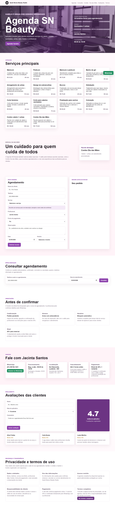
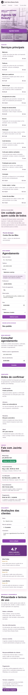
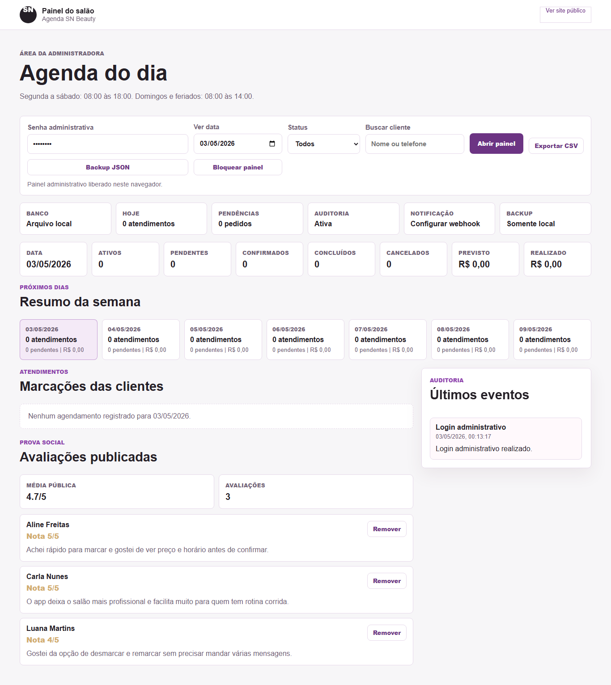

# Agenda SN Beauty


Aplicativo de agendamento para o **Sarah Neves Beauty Studio**, com experiência pública responsiva, painel administrativo protegido e persistência em Supabase ou arquivo local.

O projeto foi pensado para um salão pequeno operar com mais organização: a cliente escolhe serviço, profissional, data, horário e forma de pagamento; a profissional acompanha pedidos, status, remarcações, avaliações, exportações e auditoria em uma área reservada.

## Preview

| Site público | Mobile | Painel administrativo |
| --- | --- | --- |
|  |  |  |

## Destaques

- Agendamento com validação de conflito por duração real do serviço.
- Catálogo de serviços com preço, duração, descrição e regra de sinal de 20%.
- Painel administrativo com login, cookie HTTP-only e sessão assinada.
- Filtro por data, busca por cliente, status e visão semanal no painel.
- Confirmação, conclusão, cancelamento e remarcação de atendimentos.
- Consulta pública segura do próprio agendamento por telefone e data.
- Aceite obrigatório dos termos e regras antes de criar o pedido.
- Avaliações públicas com média, antispam simples e moderação administrativa.
- Exportação CSV, backup JSON e auditoria administrativa.
- Monitor de saúde com status de storage, Supabase, notificações e auditoria.
- Página formal de termos e privacidade.
- Testes automatizados de API, responsividade e navegador headless.

## Stack

- **Front-end:** HTML, CSS e JavaScript sem framework.
- **Back-end:** Node.js, Express e APIs REST.
- **Banco:** Supabase em produção ou `database.json` em desenvolvimento.
- **Deploy:** Render.
- **Qualidade:** smoke tests, teste responsivo estático, teste visual com Playwright e `npm audit`.

## Como Rodar

```bash
npm install
npm start
```

Depois acesse:

```text
http://localhost:5175
```

O painel administrativo fica em:

```text
http://localhost:5175/admin
```

## Variáveis de Ambiente

Crie um `.env` local com base em `.env.example`:

```text
ADMIN_PIN=sua-senha-administrativa
ADMIN_SESSION_SECRET=seu-segredo-de-sessao
SUPABASE_URL=https://seu-projeto.supabase.co
SUPABASE_SERVICE_ROLE_KEY=sua-service-role-key
NOTIFICATION_WEBHOOK_URL=https://exemplo.com/webhook-de-agendamento
```

`SUPABASE_URL`, `SUPABASE_SERVICE_ROLE_KEY` e `NOTIFICATION_WEBHOOK_URL` são opcionais em desenvolvimento. Sem Supabase, o app usa `database.json` como fallback local.

## Qualidade

As regras completas de politica, responsividade, confiabilidade, seguranca, qualidade e negocio ficam em [`docs/quality-policy.md`](docs/quality-policy.md).

```bash
npm run quality
```

Esse comando sobe um servidor temporario para o smoke test e executa a auditoria completa:

```bash
npm run check
npm run smoke
npm run mobile:check
npm run responsive:audit
npm run visual:check
npm audit --omit=dev
```

Os testes cobrem:

- Sintaxe de `server.js`, `script.js` e `admin.js`.
- Abertura das páginas públicas, termos e painel.
- APIs principais de serviços, profissionais, horários, avaliações e saúde.
- Criação de agendamento temporário, bloqueio de horário duplicado e conflito parcial.
- Login administrativo, monitor, auditoria, avaliações, exportação CSV e backup JSON.
- Bloqueio público de arquivos internos do projeto.
- Layout mobile, ausência de overflow horizontal e console limpo no navegador.
- Layout responsivo auditado em celular, tablet, tablet em paisagem, notebook e desktop.
- Screenshots de validação em `artifacts/visual-check/`.

Para testar uma URL publicada:

```bash
BASE_URL=https://agenda-sn-beauty.onrender.com npm run smoke
```

## Segurança

- Agenda completa protegida por sessão administrativa.
- Cookie administrativo `HttpOnly`, `SameSite=Lax` e `Secure` em produção.
- Senha administrativa comparada com função resistente a timing attack.
- Rate limit para login, escritas públicas, avaliações e ações administrativas.
- Headers de segurança, CSP, `X-Frame-Options`, `nosniff` e política de permissões.
- Arquivos internos como `.env`, `database.json`, `server.js`, `package.json`, `render.yaml`, scripts e markdowns não são servidos publicamente.
- A `SUPABASE_SERVICE_ROLE_KEY` fica somente no servidor.
- Dados sensíveis da cliente não aparecem na consulta pública.
- Backup, exportação, monitoramento e auditoria exigem login administrativo.

## Regras de Negócio

- Datas antigas não podem receber novos agendamentos.
- A mesma profissional não pode ter atendimentos ativos sobrepostos.
- O sistema só oferece horários que terminam dentro do expediente.
- Segunda a sábado: 08:00 às 18:00.
- Domingos e feriados: 08:00 às 14:00.
- O sinal de 20% é combinado pelo WhatsApp; o app não processa pagamento online.
- O pedido público começa como pendente e depende de confirmação da profissional.
- Há tolerância de 10 minutos para atraso.
- Cancelamentos e remarcações devem ser solicitados com antecedência, preferencialmente até 2 horas antes.
- Uma remarcação solicitada dentro do prazo pode reaproveitar o mesmo sinal, conforme disponibilidade.
- Faltas sem aviso podem causar perda do sinal e exigir confirmação antecipada em novos horários.
- Cancelamento pelo salão deve permitir remarcação ou combinação de devolução do sinal.
- Status usados no painel: `pendente`, `confirmado`, `cancelado` e `concluido`.

## Persistência

O app funciona em dois modos:

- **Supabase:** recomendado para produção e deploy no Render.
- **Arquivo local:** fallback em `database.json`, útil para desenvolvimento e testes.

Para configurar o Supabase:

1. Crie um projeto no Supabase.
2. Abra o SQL Editor.
3. Execute o conteúdo de `supabase-schema.sql`.
4. Configure as variáveis no Render.
5. Confira `/api/health`; o campo `storage` deve retornar `supabase`.

Para importar dados locais:

```bash
npm run supabase:seed
```

Para verificar se a auditoria está disponível:

```bash
npm run supabase:audit
```

## Rotas Principais

### Públicas

- `GET /`
- `GET /termos`
- `GET /api/health`
- `GET /api/services`
- `GET /api/professionals`
- `GET /api/payment-methods`
- `GET /api/availability?date=AAAA-MM-DD&professional=...&serviceId=...`
- `GET /api/client/appointments?phone=...&date=AAAA-MM-DD`
- `GET /api/reviews`
- `POST /api/appointments`
- `POST /api/reviews`

### Administrativas

- `GET /admin`
- `GET /api/admin/session`
- `POST /api/admin/login`
- `POST /api/admin/logout`
- `GET /api/appointments`
- `PATCH /api/appointments/:id/cancel`
- `PATCH /api/appointments/:id/confirm`
- `PATCH /api/appointments/:id/complete`
- `PATCH /api/appointments/:id/reschedule`
- `GET /api/admin/export`
- `GET /api/admin/backup`
- `GET /api/admin/monitor`
- `GET /api/admin/audit`
- `GET /api/admin/reviews`
- `DELETE /api/admin/reviews/:id`

## Estrutura

```text
.
├── admin.html                 # Painel administrativo
├── admin.js                   # Interações do painel
├── index.html                 # Experiência pública
├── script.js                  # Interações públicas
├── server.js                  # API, segurança, validações e persistência
├── styles.css                 # Layout responsivo
├── database.json              # Dados iniciais e fallback local
├── supabase-schema.sql        # Schema do banco em produção
├── scripts/
│   ├── smoke-test.js
│   ├── visual-browser-check.js
│   ├── mobile-visual-test.js
│   ├── seed-supabase.js
│   └── check-supabase-audit.js
└── docs/screenshots/          # Imagens usadas neste README
```

## Status

Projeto auditado localmente com smoke test, teste visual em navegador headless, teste responsivo e auditoria de dependências.
